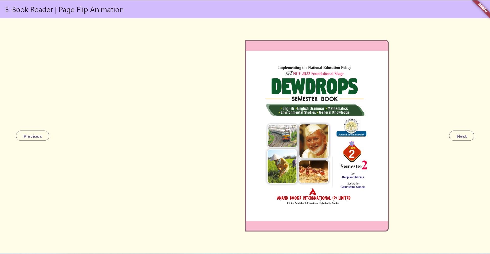
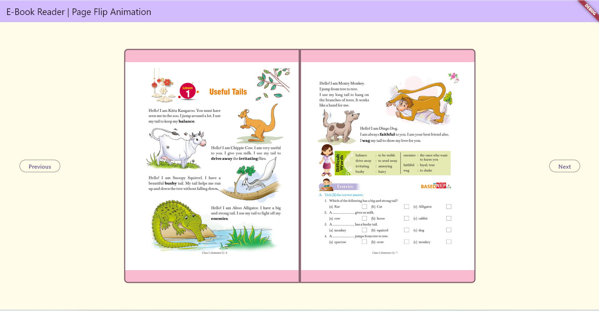

# 📚 Flutter E-Book Reader App

A beautiful and fast e-book reader built with Flutter for Android, iOS, Web, and Windows.  
Supports realistic page-flip animation and smooth reading experience across all platforms.

---

## 🚀 Features

- 📖 Realistic **page-flip animation**
- 📱 Cross-platform: Android, iOS, Web, and Windows
- 📂 Supports JPG/PNG pages (or can be modified to use a PDF)
- 🌙 Light/Dark mode support (upcoming)
- 🔍 Zooming and swipe navigation (upcoming)

---

## 🖼️ Screenshots

| FirstPage                                | MiddlePage                              |
|------------------------------------------|-----------------------------------------|
|  |  |

### 🎬 Page Flip Animation (GIF Demo)


---

## 🛠️ Tech Stack

- [Flutter](https://flutter.dev/)
- Dart
- Page Flip Animation Package: `flip_card`
- Cross-platform deployment tools

---

## 🧑‍💻 Getting Started (For Developers)

```bash
git clone https://github.com/harendraNayal/ebook-reader-page-flip.git
cd ebook-reader
flutter pub get
flutter run
```

---

## 📄 License

This project is licensed under the [MIT License](LICENSE).

---

## 🤝 Contributing

Contributions are welcome! Please read the [contributing guidelines](CONTRIBUTING.md) first.

---

## 📬 Contact

If you have any questions or suggestions, feel free to reach out:

- 💼 LinkedIn: [Harendra Singh Nayal](https://www.linkedin.com/in/harendra-singh-nayal-36590131/)
- 📧 Email: harendra.nayal91@gmail.com
- 🌐 Freelancer: [HarendraSNayal](https://www.freelancer.com/u/HarendraSNayal)
